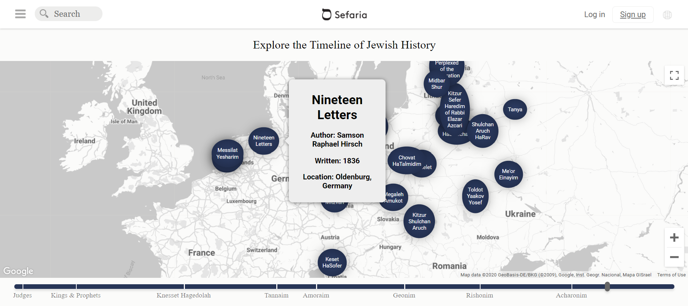

# Jewish Liturgy Map - Sefaria Challenge

### About the Project
The Jewish Liturgy Map was made for the Sefaria 2020 Engineering Challenge.
The challenge asked it's participants contribute a meaningful tool or feature to [Sefaria](https://www.sefaria.org/), a digital library for Jewish texts.
We decided to use Google Map's API to create a visual timeline map to pictorially represent the evolution and expansion of liturgy throughout the different eras of Jewish History.

### Technologies Used
- React
- Sefaria API
- Google Maps API
- react-geocode
- Material-UI

### How it Works
The Jewish Liturgy Map displays each text from the Sefaria digital library on a Google Map React component as Google Map markers. The marker is then placed where the book was published. When scrolled over, each marker displays an info-box with data about the book it represents. A slider component beneath the map allows the user to change the era the map depicts. The map then re-renders with the correct set of books.

### How to Run Locally
- clone the repo
- change directory into the project's react folder: `cd sefariachallengereact`
- run `npm install`
- run `npm start`

### Image of the Map
